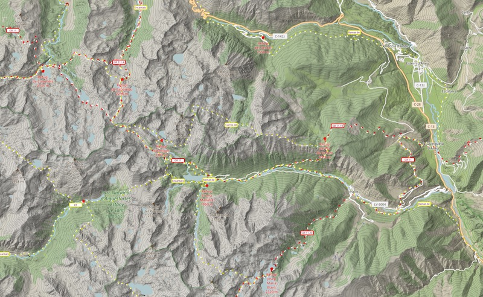
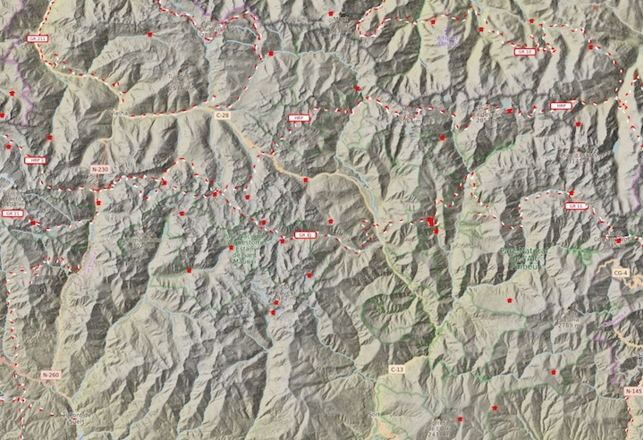

# topotresc
This is a project to build a map server customized for mountain hiking. It is based in the **OpenStreetMap** (OSM) data with high detail **hillshading** and **elevation contour lines** from different institutional open data sources. You can see the live site here: 

https://www.topotresc.com

It provides also a online map source (TMS) to be used in desktop and mobile applications:

- QMapShack
- MOBAC, SASPlanet, QGIS
- Gurumaps
- Oruxmaps
- OsmAnd
- MapPlus
- TwoNav Land


|             |     |
:-------------------------:|:-------------------------:|
|   |    |

The system is built using **mapnik** and the **gdal tools** among others. The development environment described here is built on docker.

The map include layers with **hillshading** and **elevation contour lines** to achieve an efective relief highlighting and the look-and-feel is adapted for all kind of mountain activities.


## Map features ##
### Relief ###
Highlighting relief is essential for mountain hiking. This is achieved by:
- **Elevation contours** with labels giving values (proportional to zoom levels)
- **HillShading** brings a strong relief impresium.
 

### Trails difficulty (SAC scale)
OSM data offers the possibility to distinguish hiking trails suitable for all (T1) from those reserved to experienced and well equipped hikers (T4-T5-T6). This is a tremendous advantage over any other classical topo map.

### Trails visibility
Trails visibility describes attributes regarding trail visibility (not route visibility) and orientation. OSM data makes the distinction between trail visibility and trail difficulty using two different tags. 

Rendering all the different combinations of difficulty and visibility can be confusing for the map user so a sensible approach has been taken to distinguish about six combinations based on the most common hiker profiles.


Here we can see diferent combinations of rendering for difficulty (red=easy, darker=difficult) and visibility (more dotted/smaller=less visible)


## Getting Started

### Prerequisites

- Install docker and docker-composer. This is enougth to test the system in your computer with the sample data provided.
- Optional: to create maps for other zones you need to get the openstreetmap data and the DEM (elevation data) files of the area, as explained below.
- Optional: to run the map in production you will need a proper tile server. I'm using for that a serverless approach with just an amazon AWS lamda funtion and S3 storage, not described in this document.


## Installing and building

- ### Clone and build the docker images
```
git clone https://github.com/aresta/topotresc
cd topotresc
docker-compose build
```
This includes two images: the PostgresSQL server and a image with many tools installed (Ubuntu, gdal, ogr, osmium...)


- ### Start the containers
```
docker-compose up
```
Check posible errors.  If everything is fine later you can also execute the command with the -d flag to make the containers run in backgrund, but now is better to be able to see the posible errors in the next steps.

- ### Import the sample data to the PostgreSQL database.

Open a second terminal, navigate to the project folder fix the permissions and execute the scripts:
```
chmod +x tools/scripts/*.sh tools/scripts/*.py
docker-compose exec tools /scripts/import_test_data.sh
docker-compose exec tools /scripts/render_tilezip.py
```
when the data is loaded you can start the script that reders all the tiles:

```
docker-compose exec tools /scripts/render_tilezip.py
```
This can take some time depending on the area to render.
(*Make sure that the postgres database in the container (previuos step) is up and running*).

- ### Start the tile server
If everything went fine in the previous steps (probably not ;-) you can start the simple web server based in Flask:
```
docker-compose exec tools /scripts/start_web_server.sh
```

and point your browser to:
```
http://127.0.0.1:5000
```
This is a very simple web and tile server based in Python and Flask. This is only intended for testing and the performance is very poor, but it works. 

## Customize the map to another area
To create a map of your preferred area you will need first to define the map area in a geojson file in the /mnt/conf folder. There are some example there.  

Then you have to download all the needed OSM and elevation data, see below.
You can check the rest of scripts to find how to download and build the needed data.

If you want to adapt the styles (good luck) they are in mnt/openstreetmap-carto. You can compile them with:
```
docker-compose exec tools /scripts/compile_styles.sh
```

### DEM (digital elevation model) files. 
To create a map of your preferred area you will need to download the OSM and DEM data of that zone.

**OSM data:** you can download it from several places. Check the script create_pbf.sh as an example about getting and cropping the OSM data. 

**DEM data:** (Digital Elevation Model) is needed to create the contour lines and hillshading.  For areas in Spain you can download them here: http://centrodedescargas.cnig.es/CentroDescargas/index.jsp (MDT05 is ok, 5x5m). Put them in the folder mnt/dem/es/  
For example, for the Picos area the files are:
```
PNOA_MDT05_ETRS89_HU30_0031_LID.asc
PNOA_MDT05_ETRS89_HU30_0032_LID.asc
PNOA_MDT05_ETRS89_HU30_0055_LID.asc
PNOA_MDT05_ETRS89_HU30_0056_LID.asc
PNOA_MDT05_ETRS89_HU30_0080_LID.asc
PNOA_MDT05_ETRS89_HU30_0081_LID.asc
```
The scripts create_shades.sh and create_contours.sh describes or automatize the processes.

## Examples

Visit the Pyrenees and Catalonia Topotresc map: [Mapa del Pirineo](https://topotresc.com "Mapa dels Pirineus i Catalunya")

(OSM data update updated every couple of months)


|             |     |
:-------------------------:|:-------------------------:|
|  |    |
|  |     |

### Acknowledgments
OpenStreetMap & contributors, ICGC, CNIG (among many others). CC-BY-SA
