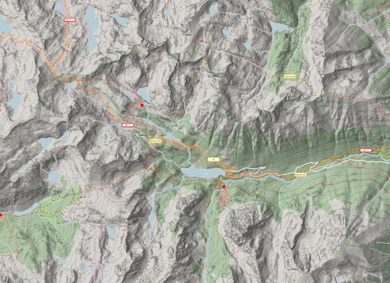
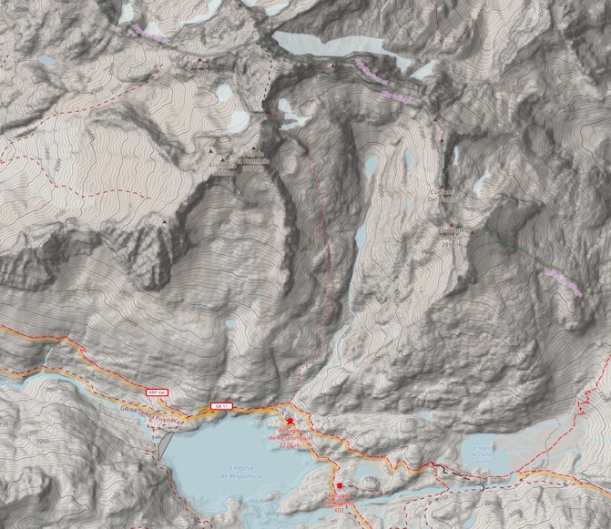
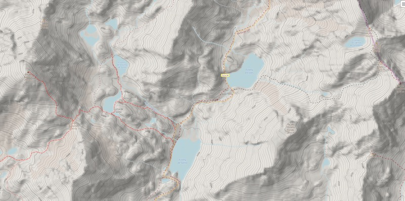
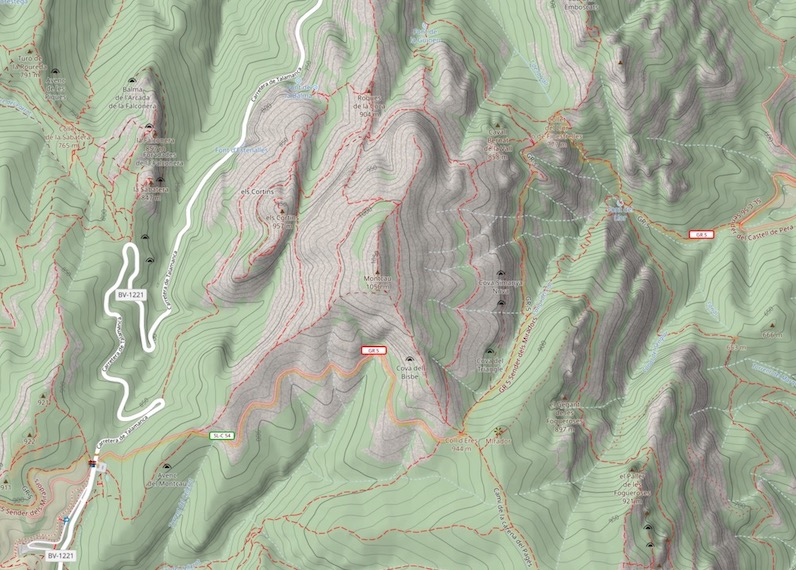

# topotresc
This is a project to build a map server customized for mountain hiking based in the **OpenStreetMap** (OSM) data, **mapnik**, apache with **mod_tile** and the **gdal tools** among others. The system is built on docker to avoid all the installation and dependencies problems.

The map include layers with **hillshading** and **elevation contour lines** to achieve an efective relief highlighting and the look-and-feel is adapted for all kind of mountain activities.


|             |     |
:-------------------------:|:-------------------------:|
|   |    |


## Map features ##
### Relief ###
Highlighting relief is essential for mountain hiking. This is achieved by:
- **Elevation contours** with labels giving values (proportional to zoom levels)
- **HillShading** brings a strong relief impresium.
 

### Trails difficulty (SAC scale)
OSM data offers the possibility to distinguish hiking trails suitable for all (T1) from those reserved to experienced and well equipped hikers (T4-T5-T6). This is a tremendous advantage over any other classical topo map.

### Trails visibility
Trails visibility describes attributes regarding trail visibility (not route visibility) and orientation. OSM data makes the distinction between trail visibility and trail difficulty using two different tags. 

Rendering all the different combinations of difficulty and visibility can be confusing for the map user so a sensible approach has been taken to distinguish about six combinations based on the most common hiker profiles.



Here we can see diferent combinations of rendering for difficulty (red=easy, darker=difficult) and visibility (more dotted/smaller=less visible)


## Quick start

### Prerequisites

- Install docker and docker-composer.
- Tested in mac. For linux and windows should work fine with minor adjustments.  


### Clone the project, build the docker images and the project

- Clone and build the docker images
```
git clone https://github.com/aresta/topotresc
cd topotresc
docker-compose build
```


- Download the DEM (digital elevation model) files of the map area. 

This is needed to create the contour lines and hillshading.  For the Picos area (or any other in Spain) you can download them here: http://centrodedescargas.cnig.es/CentroDescargas/index.jsp (MDT05 is ok, 5x5m). Put them in the folder mnt/dem/es/  
For example, for the Picos area the files are:
```
PNOA_MDT05_ETRS89_HU30_0031_LID.asc
PNOA_MDT05_ETRS89_HU30_0032_LID.asc
PNOA_MDT05_ETRS89_HU30_0055_LID.asc
PNOA_MDT05_ETRS89_HU30_0056_LID.asc
PNOA_MDT05_ETRS89_HU30_0080_LID.asc
PNOA_MDT05_ETRS89_HU30_0081_LID.asc
```


- Start the containers
```
docker-compose up
```
Check posible errors.  If everything is fine later you can also execute the command with the -d flag to make the containers run in backgrund, but now is better to be able to see the posible errors in the next steps.


- Build

Open a second terminal, navigate to the project folder and execute the script:
```
./build_all.sh
```
This can take a long time and generate a lot of GBs, depending on the area.  For the small picos area provided it is about 6GB and 30' downloading and building on a regular desktop computer.

*Note*: For windows you should only adapt the two script in the root, renaming them to .bat could be enought.  The other scripts are ok because they are executed inside the docker containers.


- Run the tile server
If everything went fine in the previous steps (probably not ;-) you can point your browser to:
```
http://localhost
```
 and cross the fingers :)

## Customize the map to another area

- One geojson file with the boundaries of the map is included (mnt/conf/picos.geojson), it covers the *Picos de Europa* mountains in Spain. If you want to render another area, you have to create a new geojson file with the limits of your map. It doesn't need to be a rectangle.
- If the area is not in Spain you have to download the PBF from that area and find the DEMs somewhere else.
- You will also need to adjust the initial coordinates to show the map in the index.js file.
- If you want to adapt the styles (good luck) they are in mnt/openstreetmap-carto. You can compile them with:
```
docker-compose exec tools /scripts/compile_styles.sh
```

## Examples

Visit the Pyrenees and Catalonia Topotresc map: [Mapa del Pirineo](https://topotresc.com "Mapa dels Pirineus i Catalunya")

(still work in progress, not always online)


|             |     |
:-------------------------:|:-------------------------:|
|  |    |
|  |     |

### Credits
OpenStreetMap & contributors, ICGC, CNIG (among many others). CC-BY-SA
